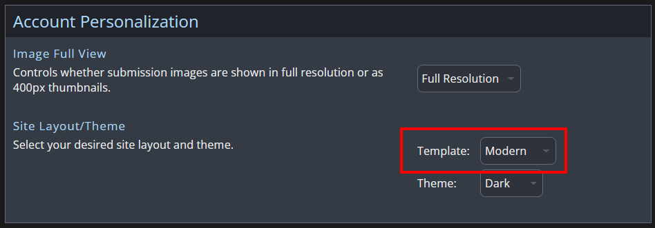
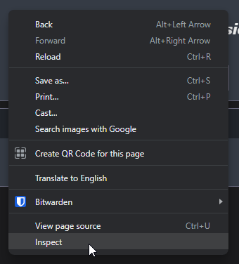
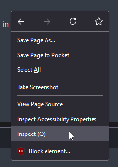
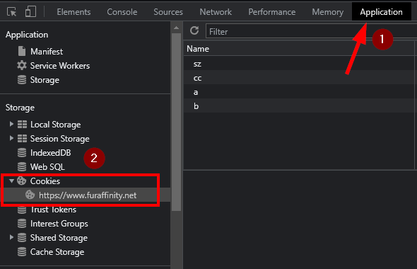
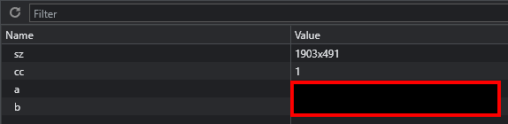
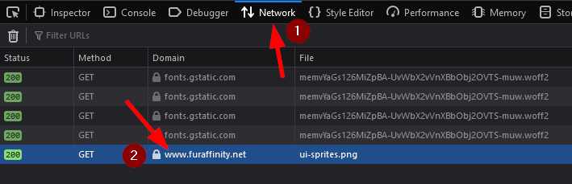
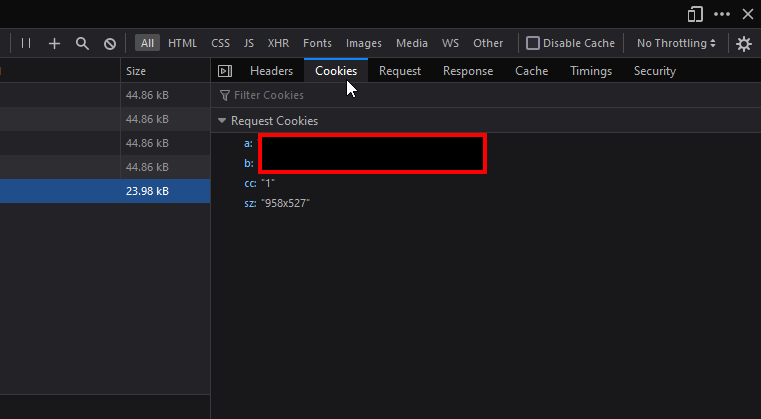
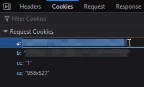
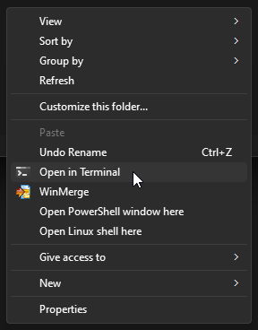

# furaffinity-account-migrator
A tool to transfer all watches and favorites from one FurAffinity account to another. 

## Setup

Because FurAffinity does not provide an API for programs to easily interface with their site, this program uses a workaround by pretending to be a web browser you've previously logged in from. As such, the setup for this is a little more involved than might be expected. The following steps require you be on a desktop, running a desktop web browser. 

1. In your web browser of choice, log into your old account. 
2. Under your [Account Settings](https://www.furaffinity.net/controls/settings/), change the Site Layout/Theme setting to use the Modern template. If this is not done, the script will fail to work. Save this change.
  
    

    
Screenshot

    

    

3. On any page on FA, right click on the page and select "Inspect" in the menu that appears. The Web Developer tools should appear.

    

    
Screenshot

    ### Chrome
    

    ### Firefox
    

    

4. The steps diverge here slightly depending on your web browser of choice. 

    * **For Chrome, Edge, and other Chromium-based browsers**: Select the "Application" tab, and in the sidebar of that pane, select Cookies -> https://www.furaffinity.net. In the main pane of the window, there should be several entries listed in the table.

        

        
Screenshots

        
        

        

    * **For Firefox**: Select the "Network" tab. In the list of entries, look for one with the domain `www.furaffinity.net` (if no such entry exists, refresh the page). Select that entry, and in the inspector on the right side, select the Cookies tab.

        

        
Screenshots

        
        

        

5. In the list of cookies, there should be two entries labeled `a` and `b`. For each entry, double click on the value to begin editing it, copy the entire value, and paste it somewhere where you can refer back to it later (I use a Notepad window). Make sure you know which value is `a` and which value is `b`. 

    

    
Screenshot

    

    

6. Either in an incognito/private browsing window or a separate browser, repeat the above steps with your new account.

Once done, you should have your login information for both accounts.

On the application side:

1. [Download and install the latest version of Node.js](https://nodejs.org/en). This project was built with Node.js 20.0.0, but it should work on 16 and later.
2. [Download and unzip this project somewhere.](https://github.com/TheAppleFreak/furaffinity-account-migrator/archive/refs/heads/main.zip)
3. Open a terminal window to that directory. On Windows, you can hold Shift and press right click in the unzipped folder, and select "Open in Terminal" to go directly there. 

    

    
Screenshots

    

    

4. Enter `npm install` to install this program's dependencies. Ignore any messages about security vulnerabilities; those don't apply to what this program does.
5. Enter `npm build` to convert the program into a form that Node.js understands. You only need to do this once.
6. Enter `npm start` to launch the program.
7. Enter the information requested when asked. In Windows, you paste by right-clicking into the terminal window. 
8. Use your arrow keys and Enter to answer the other questions when prompted.
9. Give the application some time, especially if you've got a lot of items favorited or a lot of users watched. By default, favoriting one submission or watching one artist will take a minimum of 1.5 seconds each (two pageloads with a 750ms delay between each), which can add up quite quickly. 

## Contributing

This code was written while running on no sleep and is terrible on several fronts. If you see value in this, then by all means you're welcome to submit issues suggesting improvements or PRs extending/improving its functionality. 
